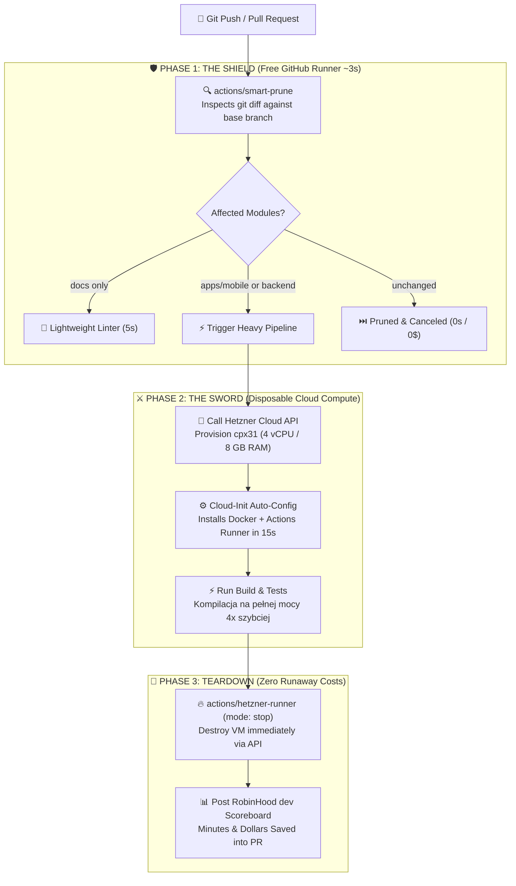

# ⚡ BlitzRunner

<p align="center">
  🌐 <strong>Languages:</strong>
  <a href="README.md"><strong>🇬🇧 English</strong></a> •
  <a href="README.pl.md">🇵🇱 Polski</a> •
  <a href="README.de.md">🇩🇪 Deutsch</a> •
  <a href="README.es.md">🇪🇸 Español</a> •
  <a href="README.fr.md">🇫🇷 Français</a>
</p>

<p align="center">
  <strong>Zero-server, high-speed CI optimization suite & ephemeral bare-metal runner orchestrator under the RobinHood dev philosophy.</strong><br>
  <em>Slashes up to 70% of redundant CI runs via ~3-second git diff pruning and accelerates heavy compilation 4x on disposable 8-vCPU Hetzner instances for pennies.</em>
</p>

<p align="center">
  <a href="https://social-wulf.eu"></a>
  <a href="LICENSE"></a>
  
  
  
  <a href="https://buymeacoffee.com/adrianwulf"></a>
  <a href="https://github.com/sponsors/adrian-wulf"></a>
</p>

<p align="center">
  
  
  
  
  
  
</p>

---

## 📑 Table of Contents
1. [⚡ Why BlitzRunner?](#-why-blitzrunner)
2. [🌐 Adrian Wulf Ecosystem](#-adrian-wulf-ecosystem)
3. [📊 Comparison: GitHub Actions vs Commercial SaaS vs BlitzRunner](#-comparison-github-actions-vs-commercial-saas-vs-blitzrunner)
4. [🏗️ System Architecture](#️-system-architecture)
5. [🚀 Quick Start](#-quick-start)
6. [🛡️ Shield: Smart Prune Action](#️-shield-smart-prune-action)
7. [⚔️ Sword: Ephemeral Cloud Runner](#️-sword-ephemeral-cloud-runner)
8. [🛠️ CLI Diagnostics & Local ROI Calculator](#️-cli-diagnostics--local-roi-calculator)
9. [☕ Support the Project & RobinHood dev](#-support-the-project--robinhood-dev)
10. [⚖️ Impressum & Legal Notice (§ 5 DDG / MIT)](#️-impressum--legal-notice--5-ddg--mit)

---

## ⚡ Why BlitzRunner?

Every modern software engineering team struggles with the same hidden cloud tax: **inflated CI/CD build times and exorbitant per-minute compute billing.**

1. **Big Tech's Throttled Hardware:** GitHub Actions defaults to anemic, dual-core (2 vCPU) virtual machines. A standard Android Gradle build, heavy Jest integration suite, or Docker compilation drags on for 10 to 15 minutes.
2. **Blind Monorepo Triggers:** If an engineer fixes a typo in a markdown document (`docs/`) or updates CSS in a frontend component, GitHub blindly launches the entire matrix—rebuilding mobile binaries, cloud functions, and end-to-end browsers for 35+ total compute minutes.
3. **The 2,000-Minute Trap:** On private repositories, the 2,000 monthly free tier minutes evaporate after barely 50 to 60 commits. After that, GitHub charges premium rates per minute.
4. **Predatory SaaS Pricing:** Commercial optimization platforms (RunsOn, WarpBuild, Nx Cloud) charge from **$50 to $500/month** just to sit between you and your cloud provider.

**BlitzRunner destroys this paradigm under the RobinHood dev philosophy:**
* **🛡️ Smart Prune (The Shield):** A zero-dependency GitHub Action inspecting `git diff` in ~3 seconds. If your code changes didn't touch a component, BlitzRunner cancels its downstream jobs immediately. Cuts up to **70% of redundant CI compute**.
* **⚔️ Ephemeral Bare-Metal Runner (The Sword):** When heavy compilation is required, BlitzRunner calls the Hetzner Cloud API to provision a high-performance **4 to 8 vCPU dedicated instance** in 15 seconds. Builds complete **4x faster**, and the VM self-destructs the moment the job finishes.
* **⚡ Zero-Server Architecture:** **No 24/7 VPS to pay for or maintain.** You only pay for the 2 to 3 minutes the server compiles code (approx. **~0.003 € per run**).
* **📊 Pull Request Scoreboard:** Injects transparent metrics into your `GITHUB_STEP_SUMMARY` showing exact minutes and dollars saved.

---

## 🌐 Adrian Wulf Ecosystem

BlitzRunner is an integral part of an independent suite of modern developer and business tools built under the **RobinHood dev** philosophy:

| Service / Project | Live URL | Purpose |
| :--- | :---: | :--- |
| ⚡ **BlitzRunner** | [github.com/adrian-wulf/blitzrunner](https://github.com/adrian-wulf/blitzrunner) | **Zero-Server CI Optimizer & Ephemeral Runner:** Cuts CI costs by 90% and accelerates builds 4x on disposable cloud compute. |
| 🛡️ **Nachtwache** | [sentry.social-wulf.eu](https://sentry.social-wulf.eu) | **Autonomous Error Tracker & Sentry Replacement:** Single Rust binary, ~15 MB RAM, SQLite WAL, and built-in AI Auto-Fix ([GitHub](https://github.com/adrian-wulf/nachtwache)). |
| 🚀 **Wulf Lead.er** | [lead.social-wulf.eu](https://lead.social-wulf.eu) | **B2B Lead Intelligence Radar & Web Auditor:** Local prospecting via OpenStreetMap, technical audits (SSL, TTFB, RWD), and Gemini OSINT ([GitHub](https://github.com/adrian-wulf/wulf-lead-er)). |
| 🌐 **Central Wulf Hub** | [social-wulf.eu](https://social-wulf.eu) | **Main Ecosystem Showcase:** Technology portfolio and developer sovereignty portal by Adrian Wulf. |
| 💼 **Wulf Code** | [wulf-code.it](https://wulf-code.it) | **Software House & Consulting:** High-performance infrastructure, cloud architecture, and security audits. |

---

## 📊 Comparison: GitHub Actions vs Commercial SaaS vs BlitzRunner

| Feature / Metric | Standard GitHub Hosted | Commercial SaaS (RunsOn / WarpBuild) | ⚡ **BlitzRunner** (Adrian Wulf) |
| :--- | :---: | :---: | :---: |
| **Monthly Subscription** | Free up to limits | **$50 to $250+ / month** | **0 zł / $0 (100% Free MIT)** |
| **Hardware Performance** | 2 vCPU, 7 GB RAM (Azure VM) | Cloud provider rates + markup | **4–8 vCPU, 8–16 GB RAM (Bare-Metal Hetzner)** |
| **Minute Cost (4–8 vCPU)** | ~$0.016 – $0.032 / min | Vendor markup + cloud bill | **~0.00025 € / min** (Direct bare-metal cloud) |
| **Build Execution Speed** | Baseline (Slow / 10m) | 2x – 3x | **4x Faster (2m on 8 cores)** |
| **Diff Pruning (Smart Shield)** | ❌ None (Triggers all jobs) | ⚠️ Costly Add-On | ✅ **Built-in (~3s Zero-Dependency)** |
| **Dedicated Server Required** | No | Yes (some require 24/7 master) | **NO (100% Zero-Server Architecture)** |
| **Telemetry & Privacy** | Microsoft telemetry | Proxied through vendor servers | **100% Direct API on your account** |
| **PR Scoreboard** | None | Limited dashboard | **Native GitHub Step Summary** |

---

## 🏗️ System Architecture

BlitzRunner operates seamlessly inside your existing GitHub repository without requiring any external coordinator server:



---

## 🚀 Quick Start

Create or update your `.github/workflows/ci.yml` in your project repository:

```yaml
name: BlitzRunner CI

on:
  push:
    branches: [main, develop]
  pull_request:
    branches: [main, develop]

jobs:
  # STEP 1: Smart Prune (Runs on free runner in ~3s)
  inspect:
    name: 🛡️ Smart Prune
    runs-on: ubuntu-latest
    outputs:
      run_mobile: ${{ steps.prune.outputs.mobile }}
      run_backend: ${{ steps.prune.outputs.backend }}
      run_docs: ${{ steps.prune.outputs.docs }}
    steps:
      - uses: actions/checkout@v4
        with:
          fetch-depth: 20
      - uses: adrian-wulf/blitzrunner/actions/smart-prune@v1
        id: prune
        with:
          filters: |
            mobile: ['apps/mobile/**', 'packages/mobile-core/**']
            backend: ['services/api/**', 'packages/shared-models/**']
            docs: ['docs/**', '*.md']

  # STEP 2: Ephemeral Runner (Spawns on Hetzner only when needed)
  spawn-runner:
    name: 🚀 Spawn Ephemeral Cloud Runner
    needs: inspect
    if: needs.inspect.outputs.run_mobile == 'true' || needs.inspect.outputs.run_backend == 'true'
    runs-on: ubuntu-latest
    outputs:
      runner_label: ${{ steps.spawn.outputs.label }}
      server_id: ${{ steps.spawn.outputs.server_id }}
    steps:
      - uses: adrian-wulf/blitzrunner/actions/hetzner-runner@v1
        id: spawn
        with:
          mode: start
          hcloud_token: ${{ secrets.HCLOUD_TOKEN }}
          github_token: ${{ secrets.GH_RUNNER_PAT }}
          server_type: cpx31 # 4 vCPU, 8 GB RAM (~0.015 € / hour)
          location: fsn1

  # STEP 3: Heavy Compilation on Dedicated Cores
  heavy-build:
    name: ⚡ High-Speed Compilation
    needs: [inspect, spawn-runner]
    if: always() && needs.spawn-runner.result == 'success'
    runs-on: ${{ needs.spawn-runner.outputs.runner_label }}
    steps:
      - uses: actions/checkout@v4
      - name: Build and Test
        run: |
          nproc
          echo "Building on dedicated 4-core cloud hardware!"
          # ./gradlew test lint / docker build

  # STEP 4: Teardown Server & Stop Billing
  teardown-runner:
    name: 🛑 Destroy VM & Stop Billing
    needs: [spawn-runner, heavy-build]
    if: always() && needs.spawn-runner.result == 'success'
    runs-on: ubuntu-latest
    steps:
      - uses: adrian-wulf/blitzrunner/actions/hetzner-runner@v1
        with:
          mode: stop
          hcloud_token: ${{ secrets.HCLOUD_TOKEN }}
          server_id: ${{ needs.spawn-runner.outputs.server_id }}
```

---

## 🛡️ Shield: Smart Prune Action

The `adrian-wulf/blitzrunner/actions/smart-prune@v1` action operates with **zero dependencies** on Node 20:

### Action Inputs
| Input | Description | Default | Required |
| :--- | :--- | :---: | :---: |
| `filters` | YAML mapping of component keys to glob patterns. | N/A | **Yes** |
| `base_ref` | Git ref/SHA to diff against (auto-detected for PRs). | `HEAD~1` | No |
| `summary` | Write RobinHood Scoreboard to `GITHUB_STEP_SUMMARY`. | `true` | No |

### Action Outputs
| Output | Type | Description |
| :--- | :---: | :--- |
| `<filter_key>` | `boolean` | `"true"` if changes matched the glob patterns. |
| `any_changed` | `boolean` | `"true"` if any configured filter matched. |
| `changed_modules` | `JSON array` | Array of keys with detected modifications. |

---

## ⚔️ Sword: Ephemeral Cloud Runner

The `adrian-wulf/blitzrunner/actions/hetzner-runner@v1` action provisions bare-metal virtual servers via the Hetzner Cloud API:

### Action Inputs
| Input | Description | Default | Required |
| :--- | :--- | :---: | :---: |
| `mode` | `start` (spawn & register) or `stop` (destroy VM). | `start` | No |
| `hcloud_token` | Hetzner Cloud API token (Read & Write). | N/A | **Yes** |
| `github_token` | GitHub Personal Access Token (`repo` scope). | `GITHUB_TOKEN` | No |
| `server_type` | Instance type (`cx22`, `cpx31`, `cpx41`, `ccx23`). | `cpx31` | No |
| `location` | Datacenter (`fsn1`, `nbg1`, `hel1`, `ash`, `hil`). | `fsn1` | No |
| `server_id` | Server ID to destroy (required for `mode: stop`). | N/A | For stop |

---

## 🛠️ CLI Diagnostics & Local ROI Calculator

Test your change detection and compute ROI right from your local terminal before pushing:

```bash
# Check local git diff and see which modules will be pruned
npx blitzrunner diff

# Calculate estimated monthly savings vs standard GitHub runners
npx blitzrunner estimate
```

---

## ☕ Support the Project & RobinHood dev

<p align="center">
  <a href="https://buymeacoffee.com/adrianwulf"></a>
  <a href="https://github.com/sponsors/adrian-wulf"></a>
</p>

* ☕ **Buy Me a Coffee:** [buymeacoffee.com/adrianwulf](https://buymeacoffee.com/adrianwulf)
* 💖 **GitHub Sponsors:** [github.com/sponsors/adrian-wulf](https://github.com/sponsors/adrian-wulf)

### What is the RobinHood dev philosophy?
> **„Developers and small teams should never pay corporate ransoms for cloud compute minutes and basic optimization tooling.”**

Big Tech extracts inflated margins by throttling standard runners and running tests blindly. Commercial SaaSes charge steep monthly fees to solve a problem that should be free. **BlitzRunner exists to level the playing field**: 100% free, MIT licensed, sovereign developer tooling.

---

## ⚖️ Impressum & Legal Notice (§ 5 DDG / MIT)

* **Author:** Adrian Wulf
* **Contact:** `contact@social-wulf.eu` | [social-wulf.eu](https://social-wulf.eu)
* **License:** [MIT License](LICENSE) — free for personal and commercial use.
* **Compliance:** Developed in accordance with § 5 DDG (Telemediengesetz) and EU DSGVO / GDPR principles. Zero telemetry, zero tracking.
