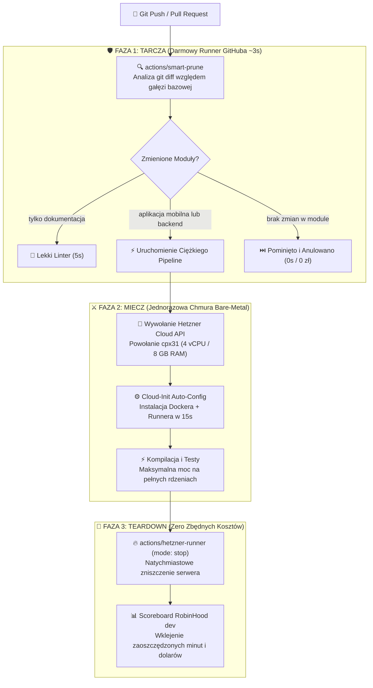

# ⚡ BlitzRunner

<p align="center">
  🌐 <strong>Języki / Languages:</strong>
  <a href="README.md">🇬🇧 English</a> •
  <a href="README.pl.md"><strong>🇵🇱 Polski</strong></a> •
  <a href="README.de.md">🇩🇪 Deutsch</a> •
  <a href="README.es.md">🇪🇸 Español</a> •
  <a href="README.fr.md">🇫🇷 Français</a>
</p>

<p align="center">
  <strong>Bezserwerowy, superszybki pakiet optymalizacji CI i orkiestrator jednorazowych maszyn chmurowych w duchu filozofii RobinHood dev.</strong><br>
  <em>Wycina do 70% zbędnych zadań CI w ~3 sekundy dzięki analizie git diff oraz przyspiesza kompilację 4x na jednorazowych maszynach 8-vCPU Hetzner za ułamki grosza.</em>
</p>

<p align="center">
  <a href="https://social-wulf.eu"></a>
  <a href="LICENSE"></a>
  
  
  
  <a href="https://buymeacoffee.com/adrianwulf"></a>
  <a href="https://github.com/sponsors/adrian-wulf"></a>
</p>

<p align="center">
  
  
  
  
  
  
</p>

---

## 📑 Spis Treści
1. [⚡ Dlaczego BlitzRunner?](#-dlaczego-blitzrunner)
2. [🌐 Ekosystem Adriana Wulfa](#-ekosystem-adriana-wulfa)
3. [📊 Porównanie: GitHub Actions vs Płatne SaaS vs BlitzRunner](#-porównanie-github-actions-vs-płatne-saas-vs-blitzrunner)
4. [🏗️ Architektura Systemu](#️-architektura-systemu)
5. [🚀 Szybki Start](#-szybki-start)
6. [🛡️ Tarcza: Akcja Smart Prune](#️-tarcza-akcja-smart-prune)
7. [⚔️ Miecz: Jednorazowy Runner Chmurowy](#️-miecz-jednorazowy-runner-chmurowy)
8. [🐳 Docker & Coolify Runner na Własnym VPS](#-docker--coolify-runner-na-własnym-vps)
9. [🛠️ Narzędzie Konsolowe CLI & Kalkulator ROI](#️-narzędzie-konsolowe-cli--kalkulator-roi)
10. [☕ Wesprzyj Projekt & Filozofia RobinHood dev](#-wesprzyj-projekt--filozofia-robinhood-dev)
11. [⚖️ Impressum & Nota Prawna (§ 5 DDG / MIT)](#️-impressum--nota-prawna--5-ddg--mit)

---

## ⚡ Dlaczego BlitzRunner?

Każdy nowoczesny zespół programistyczny płaci ten sam ukryty haracz chmurowy: **rozdęty czas oczekiwania na buildy i zawyżone opłaty za minuty maszyn wirtualnych.**

1. **Powolne maszyny korporacyjne:** GitHub Actions domyślnie przydziela słabe, 2-rdzeniowe maszyny wirtualne (2 vCPU). Standardowa kompilacja Androida w Gradle, ciężkie testy integracyjne Jest czy build kontenera Docker wleką się po 10–15 minut.
2. **Ślepe odpalanie w monorepo:** Gdy programista poprawi literówkę w pliku Markdown (`docs/`) lub zmieni kolor przycisku w CSS, GitHub Actions bezmyślnie uruchamia całą macierz – kompilując aplikacje mobilne, backend i testy E2E (łącznie ponad 35 minut czasu maszynowego!).
3. **Pułapka 2 000 darmowych minut:** W prywatnych repozytoriach darmowa pula znika po zaledwie 50–60 pushach. Każda kolejna minuta jest bezlitośnie fakturowana.
4. **Płatne platformy pośredniczące:** Komercyjne platformy (RunsOn, WarpBuild, Nx Cloud) każą sobie płacić od **$50 do $500 miesięcznie** za sam fakt postawienia tańszego serwera pod testy.

**BlitzRunner niszczy ten problem w duchu filozofii RobinHood dev:**
* **🛡️ Smart Prune (Tarcza):** Akcja GitHub bez żadnych zewnętrznych zależności badająca `git diff` w ~3 sekundy. Jeśli commit nie dotknął danego modułu, zadanie jest natychmiast anulowane. Oszczędza do **70% zbędnych minut**.
* **⚔️ Ephemeral Bare-Metal Runner (Miecz):** Gdy wymagana jest potężna moc, BlitzRunner w 15 sekund powołuje przez API dedykowaną maszynę **4–8 vCPU w Hetzner Cloud**. Testy kończą się **4x szybciej**, a serwer natychmiast ulega samozniszczeniu.
* **⚡ Architektura Zero-Server:** **Brak konieczności utrzymywania serwera 24/7.** Płacisz wyłącznie za te 2–3 minuty, kiedy maszyna realnie kompiluje kod (ok. **~0,003 € za build**).
* **📊 Scoreboard w Pull Requeście:** Automatycznie wkleja do `GITHUB_STEP_SUMMARY` czytelne podsumowanie minut i dolarów uratowanych przed GitHubem.

---

## 🌐 Ekosystem Adriana Wulfa

BlitzRunner jest integralną częścią rodziny niezależnych narzędzi inżynieryjnych i biznesowych tworzonych w duchu **RobinHood dev**:

| Usługa / Projekt | Adres URL | Przeznaczenie |
| :--- | :---: | :--- |
| ⚡ **BlitzRunner** | [github.com/adrian-wulf/blitzrunner](https://github.com/adrian-wulf/blitzrunner) | **Optymalizator CI/CD Zero-Server:** Obcina koszty CI o 90% i przyspiesza buildy 4x na jednorazowych maszynach chmurowych. |
| 🛡️ **Nachtwache** | [sentry.social-wulf.eu](https://sentry.social-wulf.eu) | **Autonomiczny Strażnik Błędów & Zamiennik Sentry:** Pojedyncza binarka Rust, ~15 MB RAM, SQLite WAL i wbudowany AI Auto-Fix ([GitHub](https://github.com/adrian-wulf/nachtwache)). |
| 🚀 **Wulf Lead.er** | [lead.social-wulf.eu](https://lead.social-wulf.eu) | **Radar Leadowy B2B & Audytor WWW:** Geolokalizacja firm z OpenStreetMap, audyty techniczne (SSL, TTFB, RWD) i wywiad Google OSINT ([GitHub](https://github.com/adrian-wulf/wulf-lead-er)). |
| 🌐 **Central Wulf Hub** | [social-wulf.eu](https://social-wulf.eu) | **Główny Portal Ekosystemu:** Portfolio projektów i centrum suwerenności technologicznej Adriana Wulfa. |
| 💼 **Wulf Code** | [wulf-code.it](https://wulf-code.it) | **Software House & Doradztwo:** Wydajne systemy chmurowe, audyty bezpieczeństwa i optymalizacja kosztów IT. |

---

## 📊 Porównanie: GitHub Actions vs Płatne SaaS vs BlitzRunner

| Cecha / Metryka | Oficjalny GitHub Hosted | Płatne SaaS (RunsOn / WarpBuild) | ⚡ **BlitzRunner** (Adrian Wulf) |
| :--- | :---: | :---: | :---: |
| **Miesięczny abonament** | 0 zł (do limitu) | **od $50 do $250+ / mc** | **0 zł (100% Wolny MIT)** |
| **Wydajność procesora** | Słabe 2 vCPU, 7 GB RAM (Azure) | Cennik chmury + prowizja dostawcy | **4–8 vCPU, 8–16 GB RAM (Dedykowany Hetzner)** |
| **Koszt minuty (4–8 vCPU)** | ~$0.016 – $0.032 / min | Marża pośrednika + chmura | **~0.00025 € / min** (Ceny bezpośrednie Hetzner) |
| **Szybkość kompilacji** | Powolna (baza 10 min) | 2x – 3x | **4x Szybciej (2 min na 8 rdzeniach)** |
| **Filtr zmian (Smart Prune)** | ❌ Brak (odpala wszystko) | ⚠️ Płatny dodatek | ✅ **Wbudowany (detekcja ~3s)** |
| **Wymagany stały serwer** | Nie | Często tak (master 24/7) | **NIE (100% Architektura Zero-Server)** |
| **Prywatność i Telemetria** | Telemetria Microsoftu | Ruch przez serwery pośrednika | **100% Bezpośrednie API na Twoim koncie** |
| **Scoreboard w PR** | Brak | Ograniczony dashboard | **Natywne podsumowanie Step Summary** |

---

## 🏗️ Architektura Systemu

BlitzRunner działa bezpośrednio wewnątrz Twojego repozytorium na GitHubie, bez konieczności stawiania zewnętrznych serwerów koordynujących:



---

## 🚀 Szybki Start

Dodaj plik `.github/workflows/ci.yml` do swojego repozytorium:

```yaml
name: BlitzRunner CI

on:
  push:
    branches: [main, develop]
  pull_request:
    branches: [main, develop]

jobs:
  # KROK 1: Smart Prune (Darmowy runner GitHuba, ~3 sekundy)
  inspect:
    name: 🛡️ Smart Prune
    runs-on: ubuntu-latest
    outputs:
      run_mobile: ${{ steps.prune.outputs.mobile }}
      run_backend: ${{ steps.prune.outputs.backend }}
      run_docs: ${{ steps.prune.outputs.docs }}
    steps:
      - uses: actions/checkout@v4
        with:
          fetch-depth: 20
      - uses: adrian-wulf/blitzrunner/actions/smart-prune@v1
        id: prune
        with:
          filters: |
            mobile: ['apps/mobile/**', 'packages/mobile-core/**']
            backend: ['services/api/**', 'packages/shared-models/**']
            docs: ['docs/**', '*.md']

  # KROK 2: Jednorazowy Runner (Odpala się na Hetznerze tylko gdy trzeba)
  spawn-runner:
    name: 🚀 Uruchomienie Maszyny Chmurowej
    needs: inspect
    if: needs.inspect.outputs.run_mobile == 'true' || needs.inspect.outputs.run_backend == 'true'
    runs-on: ubuntu-latest
    outputs:
      runner_label: ${{ steps.spawn.outputs.label }}
      server_id: ${{ steps.spawn.outputs.server_id }}
    steps:
      - uses: adrian-wulf/blitzrunner/actions/hetzner-runner@v1
        id: spawn
        with:
          mode: start
          hcloud_token: ${{ secrets.HCLOUD_TOKEN }}
          github_token: ${{ secrets.GH_RUNNER_PAT }}
          server_type: cpx31 # 4 vCPU, 8 GB RAM (~0.015 € / godzinę)
          location: fsn1

  # KROK 3: Ciężka Kompilacja na Dedykowanych Rdzeniach
  heavy-build:
    name: ⚡ Błyskawiczna Kompilacja
    needs: [inspect, spawn-runner]
    if: always() && needs.spawn-runner.result == 'success'
    runs-on: ${{ needs.spawn-runner.outputs.runner_label }}
    steps:
      - uses: actions/checkout@v4
      - name: Build i Testy
        run: |
          nproc
          echo "Kompilacja na dedykowanym 4-rdzeniowym serwerze Hetzner!"
          # ./gradlew test lint / docker build

  # KROK 4: Zniszczenie Maszyny i Zatrzymanie Naliczania Opłat
  teardown-runner:
    name: 🛑 Zniszczenie Maszyny
    needs: [spawn-runner, heavy-build]
    if: always() && needs.spawn-runner.result == 'success'
    runs-on: ubuntu-latest
    steps:
      - uses: adrian-wulf/blitzrunner/actions/hetzner-runner@v1
        with:
          mode: stop
          hcloud_token: ${{ secrets.HCLOUD_TOKEN }}
          server_id: ${{ needs.spawn-runner.outputs.server_id }}
```

---

## 🛡️ Tarcza: Akcja Smart Prune

Akcja `adrian-wulf/blitzrunner/actions/smart-prune@v1` działa z **zerowymi zależnościami** na Node 20:

### Wejścia akcji (Inputs)
| Wejście | Opis | Wartość domyślna | Wymagane |
| :--- | :--- | :---: | :---: |
| `filters` | Mapa YAML z nazwami modułów i maskami plików glob. | Brak | **Tak** |
| `base_ref` | Referencja/SHA do diffa (dla PR wykrywana automatycznie). | `HEAD~1` | Nie |
| `summary` | Generowanie raportu Scoreboard do `GITHUB_STEP_SUMMARY`. | `true` | Nie |

### Wyjścia akcji (Outputs)
| Wyjście | Typ | Opis |
| :--- | :---: | :--- |
| `<klucz_modulu>` | `boolean` | `"true"` jeśli wykryto zmiany w plikach danego modułu. |
| `any_changed` | `boolean` | `"true"` jeśli którykolwiek moduł uległ modyfikacji. |
| `changed_modules` | `JSON array` | Tablica ze zmienionymi nazwami modułów. |

---

## ⚔️ Miecz: Jednorazowy Runner Chmurowy

Akcja `adrian-wulf/blitzrunner/actions/hetzner-runner@v1` zarządza maszynami przez Hetzner Cloud API:

### Wejścia akcji (Inputs)
| Wejście | Opis | Wartość domyślna | Wymagane |
| :--- | :--- | :---: | :---: |
| `mode` | `start` (powołanie i rejestracja) lub `stop` (zniszczenie). | `start` | Nie |
| `hcloud_token` | Token Hetzner Cloud API (uprawnienia Read & Write). | Brak | **Tak** |
| `github_token` | Osobisty token GitHub PAT (uprawnienie `repo`). | `GITHUB_TOKEN` | Nie |
| `server_type` | Typ instancji (`cx22`, `cpx31`, `cpx41`, `ccx23`). | `cpx31` | Nie |
| `location` | Centrum danych (`fsn1`, `nbg1`, `hel1`, `ash`, `hil`). | `fsn1` | Nie |
| `server_id` | ID serwera do usunięcia (wymagane przy `mode: stop`). | Brak | Dla stop |

---

## 🐳 Docker & Coolify Runner na Własnym VPS

BlitzRunner udostępnia oficjalny, wieloarchitekturorowy obraz Docker (`linux/amd64`, `linux/arm64`), dzięki któremu uruchomisz własnego, stałego runnera na dowolnym VPS (np. Oracle Cloud ARM64, Hetzner, Coolify czy domowy serwer).

### Szybkie uruchomienie (Docker Compose / Coolify)

```yaml
services:
  blitzrunner:
    image: ghcr.io/adrian-wulf/blitzrunner:latest
    container_name: blitzrunner
    restart: unless-stopped
    environment:
      - REPO_URL=https://github.com/twoja-organizacja/twoje-repo
      - RUNNER_TOKEN=TWOJ_TOKEN_REJESTRACYJNY_RUNNERA
      # Lub podaj ACCESS_TOKEN (GitHub PAT), aby tokeny odnawiały się automatycznie:
      # - ACCESS_TOKEN=ghp_...
      - RUNNER_NAME=blitzrunner-vps
      - RUNNER_LABELS=blitzrunner,self-hosted,linux
      - RUNNER_WORKDIR=/home/runner/_work
    volumes:
      - /var/run/docker.sock:/var/run/docker.sock
      - runner_data:/home/runner/_work

volumes:
  runner_data:
```

### Zmienne środowiskowe kontenera

| Zmienna | Opis | Wartość domyślna |
| :--- | :--- | :---: |
| `REPO_URL` | Adres URL repozytorium (`https://github.com/org/repo`) lub organizacji. | **Wymagane** |
| `RUNNER_TOKEN` | Jednorazowy token z ustawień GitHub Actions. | Wymagane (lub `ACCESS_TOKEN`) |
| `ACCESS_TOKEN` | GitHub PAT (zakres `repo`), pozwala na automatyczne odnawianie i usuwanie runnera. | Opcjonalne |
| `RUNNER_NAME` | Nazwa runnera widoczna na GitHubie. | `blitzrunner-<hostname>` |
| `RUNNER_LABELS` | Etykiety po przecinku dla parametru `runs-on`. | `blitzrunner,self-hosted,linux,<arch>` |
| `RUNNER_WORKDIR` | Ścieżka robocza zadań runnera. | `_work` |
| `EPHEMERAL` | Zakończ kontener natychmiast po wykonaniu pojedynczego zadania. | `false` |
| `DISABLE_AUTO_UPDATE` | Wyłącz automatyczne aktualizacje binarne przez GitHuba. | `true` |

---

## 🛠️ Narzędzie Konsolowe CLI & Kalkulator ROI

Przetestuj działanie filtra i oblicz realne oszczędności bezpośrednio w swoim terminalu:

```bash
# Sprawdź lokalny git diff i które moduły zostaną pominięte
npx blitzrunner diff

# Oblicz szacowane miesięczne oszczędności vs standardowy GitHub Actions
npx blitzrunner estimate
```

---

## ☕ Wesprzyj Projekt & Filozofia RobinHood dev

<p align="center">
  <a href="https://buymeacoffee.com/adrianwulf"></a>
  <a href="https://github.com/sponsors/adrian-wulf"></a>
</p>

* ☕ **Buy Me a Coffee:** [buymeacoffee.com/adrianwulf](https://buymeacoffee.com/adrianwulf)
* 💖 **GitHub Sponsors:** [github.com/sponsors/adrian-wulf](https://github.com/sponsors/adrian-wulf)

### Czym jest filozofia RobinHood dev?
> **„Programiści i małe zespoły nie powinni płacić korporacyjnych haraczy za minuty w chmurze i podstawowe narzędzia optymalizacyjne.”**

Big Tech narzuca sztuczne marże, spowalniając maszyny i odpalając testy na ślepo. Komercyjne platformy każą sobie słono płacić za rozwiązanie problemu, który powinien być darmowy. **BlitzRunner powstał, by wyrównać szanse**: w 100% wolny, suwerenny Open Source na licencji MIT.

---

## ⚖️ Impressum & Nota Prawna (§ 5 DDG / MIT)

* **Autor:** Adrian Wulf
* **Kontakt:** `contact@social-wulf.eu` | [social-wulf.eu](https://social-wulf.eu)
* **Licencja:** [MIT License](LICENSE) — wolne do użytku prywatnego i komercyjnego.
* **Prywatność:** Narzędzie zgodne z § 5 DDG oraz europejskim RODO / DSGVO. Zero telemetrii, zero profilowania.
